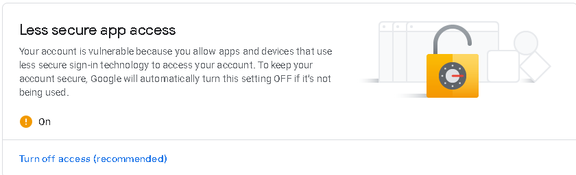

# Mailsort
Mailsort is a gmail sorting application created in Python

# What is Mailsort?

It allows you to list all of your inboxes and select different mailboxes for easier access. You can choose to skip attachment emails, or download them all at the same time. It uses regex for sorting and you can set your own extension, it could be anything such as textfiles, images, or even executables. If there are any remaining files left inside the main folder, then it will ask you where to put it.

# Instructions

1. First, enable less secure apps access so that Mailsort can log you in. You can find it inside "Manage your Google Account" > "Security" > "Less Secure App Access"

3. Run gmail.py and enter your credentials.
4. You will now be prompted questions which will make the sorting easier later on.
